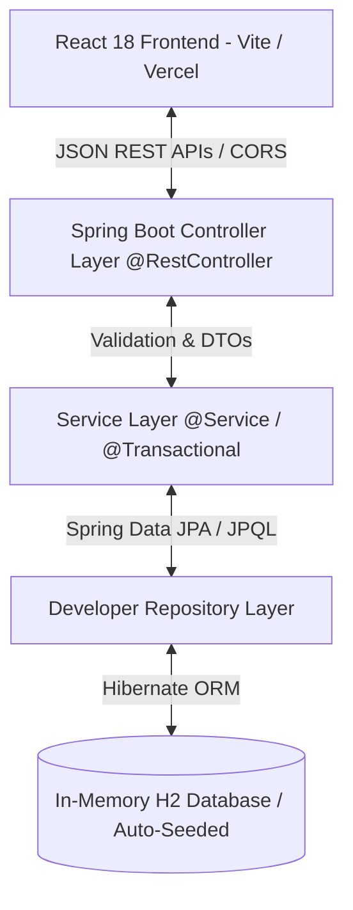

# ⚡ SkillMatrix — Enterprise Developer Talent & Bench Allocation Hub

<div align="center">

[](https://skill-matrix-coral.vercel.app/)
[](https://www.oracle.com/java/)
[](https://spring.io/projects/spring-boot)
[](https://reactjs.org/)
[](https://vitejs.dev/)
[](http://localhost:8080/swagger-ui.html)
[](LICENSE)


### 🌐 **[Click Here for Live Demo (Vercel)](https://skill-matrix-coral.vercel.app/)**
</div>

---

## 📌 Problem Statement & Enterprise Value
In global IT consultancies (like Cognizant, TCS, Infosys, Accenture), project managers constantly struggle to find available **bench developers** with exact skill combinations (e.g. *Java + Spring Boot + React + AWS*) to rapidly staff high-value client projects.

**SkillMatrix** solves this by providing:
1. **Real-time Talent & Bench Utilization KPI Dashboard** (Headcount, Available vs Allocated ratio, Bench rate %).
2. **Instant Multi-criteria Search & Skill Filtering** (Filter by stacks like Spring Boot, React, Docker, Kubernetes, AWS, PostgreSQL).
3. **1-Click Project Allocation Workflow** (Assign engineers to client engagements or release them back to bench).
4. **Enterprise Profile Management (CRUD)** (Add, Edit, View, and Delete engineer profiles with strict validation).

---

## 🏛️ System Architecture



### 🧱 Layered Architecture Highlights:
* **Controller Layer (`@RestController`)**: Implements clean RESTful standards, proper HTTP status codes (`200 OK`, `201 Created`, `204 No Content`, `400 Bad Request`, `404 Not Found`, `409 Conflict`).
* **DTO Pattern (`DeveloperRequestDTO` / `DeveloperResponseDTO`)**: Decouples internal database entities from external API request/response payloads.
* **Service Layer (`DeveloperServiceImpl`)**: Implements interface-based business logic, transactional boundaries (`@Transactional`), and statistical aggregations.
* **Global Exception Handling (`@RestControllerAdvice`)**: Centralized exception handler with standard RFC-7807 error responses.
* **Database & Persistence**: Spring Data JPA with custom JPQL queries and zero-config **H2 In-Memory Database** with automatic seed data on startup.
* **Frontend**: Modern glassmorphic dark-theme UI with responsive cards, live badge indicators, and smooth modal forms.

---

## 🚀 Key Features

* 📊 **Live KPI Metrics**: Real-time counters for Total Engineers, Bench Available, Client Allocated, and Bench Rate %.
* 🔍 **Smart Skill Filters**: Search by keyword or 1-click filter by top industry skills (`Java`, `Spring Boot`, `React`, `AWS`, `Docker`, `Kubernetes`, etc.).
* 💼 **Project Allocation**: 1-click assign developers to enterprise client projects (`HSBC`, `Aetna`, `JPMorgan`, `Walmart`).
* 🔄 **Bench Release**: 1-click toggle back to `AVAILABLE` status.
* 📝 **Full CRUD Operations**: Create and edit profiles with client-side & server-side validation.
* 📑 **Interactive OpenAPI / Swagger UI**: Built-in interactive documentation to test all endpoints in browser.

---

## 📋 REST API Specification

| HTTP Method | Endpoint | Description | Status Codes |
|:---|:---|:---|:---|
| `GET` | `/api/v1/developers` | Retrieve all developers (filters: `?search=`, `?status=`, `?skill=`) | `200 OK` |
| `GET` | `/api/v1/developers/{id}` | Fetch a single developer by ID | `200 OK`, `404 Not Found` |
| `POST` | `/api/v1/developers` | Create a new developer profile | `201 Created`, `400 Bad Request`, `409 Conflict` |
| `PUT` | `/api/v1/developers/{id}` | Update existing developer profile | `200 OK`, `400 Bad Request`, `404 Not Found` |
| `PATCH` | `/api/v1/developers/{id}/allocate` | Allocate developer to a client project | `200 OK`, `404 Not Found` |
| `PATCH` | `/api/v1/developers/{id}/release` | Release developer back to bench (`AVAILABLE`) | `200 OK`, `404 Not Found` |
| `DELETE` | `/api/v1/developers/{id}` | Delete developer profile | `204 No Content`, `404 Not Found` |
| `GET` | `/api/v1/developers/stats` | Get dashboard KPIs and top skill metrics | `200 OK` |

---

## 💻 Tech Stack & Libraries

### **Backend**
* **Java 17 / 21**
* **Spring Boot 3.2.4**
* **Spring Data JPA & Hibernate**
* **H2 In-Memory Database**
* **Bean Validation (`jakarta.validation`)**
* **SpringDoc OpenAPI 3.0 (Swagger UI)**
* **JUnit 5 & Mockito (Unit Testing)**
* **Maven Build Tool**

### **Frontend**
* **React 18**
* **Vite 5**
* **Modern Vanilla CSS & Glassmorphism**
* **Lucide Icons & Vector Graphics**

---

## 🏃 Local Setup & Run Guide

### Prerequisites
* Java JDK 17 or higher
* Node.js & npm *(optional, standalone runner included)*
* Git

### 1. Clone the Repository
```bash
git clone https://github.com/RidhimaSharma11404/SkillMatrix.git
cd SkillMatrix
```

### 2. Run the Spring Boot Backend
```bash
cd backend
mvn spring-boot:run
```
* **API Base URL**: `http://localhost:8080`
* **Swagger UI Documentation**: `http://localhost:8080/swagger-ui.html`
* **H2 Database Console**: `http://localhost:8080/h2-console` *(JDBC URL: `jdbc:h2:mem:skillmatrixdb`)*

### 3. Run the React Frontend
```bash
cd ../frontend
npm install
npm run dev
```
* **Frontend UI**: `http://localhost:5173`

*(Alternatively, you can double-click `launch_demo.bat` or open `index.html` directly in any browser for an instant zero-setup local demo!)*

---

## 🐳 Docker Deployment

Run the entire full-stack application with a single command:
```bash
docker-compose up --build
```
* Frontend will be live at `http://localhost:5173`
* Backend API will be live at `http://localhost:8080`

---


## 👤 Author
**Ridhima Sharma**
* **GitHub**: [@RidhimaSharma11404](https://github.com/RidhimaSharma11404)
* **Live Demo**: [https://skill-matrix-coral.vercel.app/](https://skill-matrix-coral.vercel.app/)

---
<div align="center">
⭐ If you found this project helpful, please consider giving it a star on GitHub!
</div>
